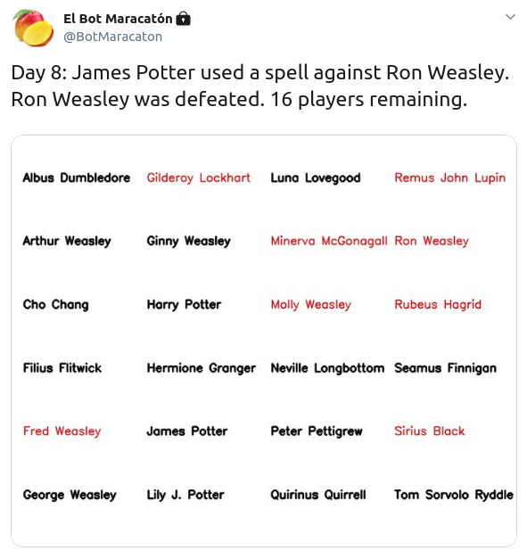

# Twitter Battle Royale Bot

This project consists of a bot developed in Python, which allows the user to recreate a Battle Royale style war, publishing each update as a tweet. The game generates random fights between different people or characters, each fight will have a loser and a winner, losers will be eliminated for the next rounds. Game ends when there is only one player left.

Each time the main script is executed a tweet like the following will be published. An image with the updated list of players will be automatically generated. Eliminated players appear in a red font style:

<p align="center">
    
</p>
## Getting Started

Before starting to customize the battle it is necessary to follow the next steps to get the copy of the bot up and running.

### Prerequisites

The project was developed using [Python 3.7.4](https://www.python.org/downloads/).

Requiered packages are:

* [Numpy](https://www.numpy.org/) (v 1.17.0) -  Used to create random choices from a list.
* [OpenCV](https://opencv.org/) (v 4.1.0.25) -  Image generation.
* [Tweepy](https://www.tweepy.org/) (v 3.8.0) - Library to handle Twitter API.

### Installing required packages

A simple way to get every package installed in your environment is using [pip](https://pypi.org/project/pip/) executing the following command in the project root.

```
pip3 install -r requirements.txt
```

## Customizing war data

### Tweet message

Every tweet published by the bot will follow the same format:

```
Day <number of current round>: <Winner name> <Winner message> <Loser name>. <Loser name> has been defeated. <Number of remaining players> players remaining.
```

Last tweet (when the last two players have the last fight) follows a similar format, changing the final message:

```
Day <number of current round>: <Winner name> <Winner message> <Loser name>. <Loser name> has been defeated. <Winner name> has won the game!
```

Tweet format can be modified editing [these lines of war.py](https://github.com/DavidGarciaFer/twitter-battle-bot/blob/d1d5444f4b5636e41dc1bb38f99876dbd508502e/war.py#L109-113).

### Player information file

A comma separated value file should be provided in order to generate the list of players and the message for each tweet. Each row in the file should follow the format ```name,message``` where ```name``` will represent player's name and ```message``` the message to be displayed in the tweet. 

```
Harry Potter,has called Hedwig to attack
Ron Weasley,has killed (unintentionally)
Hermione Granger,has managed to get rid of
```

An [example file](data/harry_potter.txt) is provided for testing purposes, with Harry Potter characters.

## Generating war data

TODO

## Running tests

TODO

## Setting up Twitter API

## How to automate the execution

TODO

## Authors

* [David García Fernández](https://github.com/DavidGarciaFer) - *Initial work* - Personal blog: [davidgarciafer.github.io](https://davidgarciafer.github.io)

## License

This project is licensed under the MIT License - see the [LICENSE](LICENSE) file for details

## Acknowledgments

* TODO
